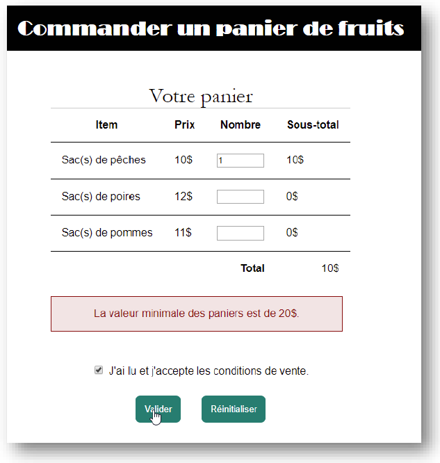

# S5 - JS OO
Vous avez droit à tout votre matériel. Il est suggéré de l'organiser comme si vous étiez en évaluation.
Le temps estimé pour cette évaluation est d'environ 2h30. Il est suggéré de se minuter pour cet exercice.
Répondre directement dans le README.md pour les questions de compréhension.

# Aperçu
À l’aide des fichiers fournis, vous allez créer un formulaire interactif qui permet de commander un panier de fruits. 
Lorsque les utilisateurs modifient un champ du formulaire, la commande est automatiquement mise à jour. 

Utiliser une ou deux classes d'objets comme fruit et/ou panier.

Voici un exemple du site terminé qui affiche une erreur quand le formulaire est soumis avec une valeur de panier de moins de 20$.

# Instructions
1. Faire les corrections/ajouts/modifications nécessaires pour que :
    - Les données du formulaire soient envoyées à la page merci.html.
    - Les données du formulaire ne soient pas envoyées dans l'URL.
    - Quand on change la valeur d'un champ, on doit mettre à jour le sous-total pour ce type de sacs (évènement `onchange`).

2. Corriger les fautes dans le code fourni :
     - Corriger le tableau fourni.
     - Corriger les champs fournis (tous les attributs nécessaires)
   
3. Valider les données entrées dans le formulaire selon les restrictions suivantes :
    - Le nombre de fruits, par type et au total, doit être compris entre 0 et 24 (ex. on ne peut pas commander 25 pommes, ni 13 pommes et 12 poires)
    - La valeur minimale du panier (tous types de fruits ensemble), pour passer la commande, est 20$.
    - La valeur par défaut du nombre de fruits est zéro 
    - «J'ai lu et j'accepte les conditions de vente.» doit être coché pour passer la commande.
   
4. Mise en forme
  - Compléter ce qui est fourni
  - Il n'est pas nécessaire d'avoir une mise en forme complètement identique (ex. ne passer pas de temps à chercher les polices exactes).

